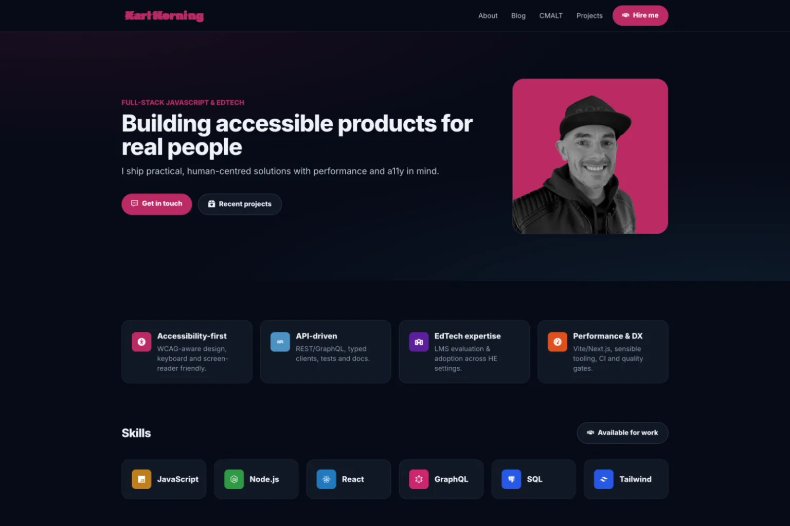

# KarlHorning.dev — Developer Portfolio

---


---

## Table of Contents

- [KarlHorning.dev — Developer Portfolio](#karlhorningdev--developer-portfolio)
  - [Table of Contents](#table-of-contents)
  - [Overview](#overview)
  - [Design Approach](#design-approach)
  - [Accessibility \& Performance](#accessibility--performance)
    - [Accessibility Principles](#accessibility-principles)
    - [Performance Practices](#performance-practices)
  - [Screenshot](#screenshot)
  - [Tech Stack](#tech-stack)
  - [Installation](#installation)
  - [Scripts](#scripts)
  - [Project Structure](#project-structure)
  - [Code Style \& Linting](#code-style--linting)
  - [Tests](#tests)
    - [Current Setup](#current-setup)
    - [Planned Additions](#planned-additions)
  - [Live Site](#live-site)
    - [Lighthouse Scores (16 Oct 2025)](#lighthouse-scores-16-oct-2025)
  - [Roadmap](#roadmap)
  - [Further Reading](#further-reading)
  - [Licence](#licence)
  - [Author](#author)

---

## Overview

**KarlHorning.dev** is my centralised developer portfolio — a single, accessible [Next.js](https://nextjs.org/) build that unifies my **projects**, **blog**, and **CMALT portfolio** into one modular, maintainable codebase.

The site reflects my approach to professional front-end development:

- built for **accessibility**, **performance**, and **clarity**
- structured around predictable, typed data
- documented consistently through **JSDoc** and **TypeScript**

Migrating from Eleventy to Next.js reduced maintenance by roughly **2-3 hours per month**, while improving accessibility, scalability, and performance.

---

## Design Approach

The design emphasises **clarity**, **readability**, and **inclusivity** over visual excess.

- **Layout:** Grid-based with clear typographic hierarchy
- **Colours:** Accessible palette for light and dark modes (`#F6E6EC`, `#C1EOF6`, `#EDABC6`, `#4C9DCD`, `#CB2D6F`, `#163753`)
- **Animations:** Minimal and purposeful — for example, a subtle CSS glitch hover effect on the logo
- **Responsiveness:** Mobile-first, designed for clarity across all viewports
- **Interaction:** Fully keyboard- and screen reader-accessible

The overall aesthetic aims for calm professionalism while meeting **WCAG 2.2 AA** standards.

---

## Accessibility & Performance

Accessibility and performance are tested continuously during development and deployment with **Lighthouse**, **axe**, and **WAVE**.

### Accessibility Principles

- Semantic HTML and consistent ARIA roles
- Visible "Skip to content" link
- Logical heading hierarchy
- Descriptive `alt` text for media
- Fully labelled, focus-managed form elements
- Verified contrast ratios for all modes

### Performance Practices

- **Static generation** via `next export`
- **Optimised media** using Sharp and Next/Image
- **No third-party tracking scripts**
- **Lighthouse scores:**

  - Performance: 97 (Mobile) / 99 (Desktop)
  - Accessibility: 100
  - Best Practices: 100
  - SEO: 100

---

## Screenshot



---

## Tech Stack

- **Framework:** Next.js 16 (App Router)
- **Language:** TypeScript (strict mode)
- **UI:** React 19 + Tailwind CSS
- **Tooling:** ESLint + Prettier (Tailwind plugin)
- **Icons:** React Icons
- **Images:** Sharp for optimisation
- **Deployment:** GitHub Pages (static export)
- **Accessibility:** WCAG-aware, semantic components
- **CI/CD:** GitHub Actions (linting, type checks, build, and export)

---

## Installation

```bash
git clone https://github.com/Karl-Horning/Karl-Horning.github.io.git
cd Karl-Horning.github.io
npm install
```

---

## Scripts

| Command              | Description                                        |
| -------------------- | -------------------------------------------------- |
| `npm run dev`        | Start local development with Turbopack             |
| `npm run build`      | Build for production                               |
| `npm start`          | Serve static build locally                         |
| `npm run lint`       | Run ESLint checks                                  |
| `npm run build:data` | Regenerate JSON data (projects, posts, CMALT, RSS) |

---

## Project Structure

```bash
src/
├── app/            # App Router pages (Home, About, Projects, CMALT, etc.)
├── components/     # Reusable UI and layout components
├── lib/            # Metadata, constants, and helper functions
├── types/          # Shared TypeScript types
├── public/data/    # JSON-based blog, project, and CMALT data
```

The architecture follows a **clear separation of concerns** between content, types, and logic — designed for scalability and maintainability.

---

## Code Style & Linting

- **ESLint** with `eslint-config-next`
- **Prettier** with Tailwind CSS plugin
- **Conventional Commits** (with scopes such as `a11y` and `ux`)
- **JSDoc** for function and dataset documentation

---

## Tests

Automated accessibility testing is powered by **Playwright** and **axe-core**, ensuring all routes meet WCAG 2.2 AA standards.

### Current Setup

- **Framework:** [Playwright](https://playwright.dev/)
- **Engine:** [axe-core](https://github.com/dequelabs/axe-core) via `@axe-core/playwright`
- **Scope:** `/`, `/about`, `/blog`, `/cmalt`, `/contact`, `/projects`, `/demos`
- **Environment:** Headless Chromium

Each page is loaded in a real browser environment, scanned with `axe-core`, and must pass with zero accessibility violations before the build is considered successful.

```bash
npm run test
```

**Example Output:**

```bash
Running 7 tests using 1 worker
✓  A11y: / (1.2s)
✓  A11y: /about (1.6s)
✓  A11y: /blog (0.9s)
✓  A11y: /cmalt (0.8s)
✓  A11y: /contact (0.8s)
✓  A11y: /demos (0.7s)
✓  A11y: /projects (0.8s)

7 passed (8.2s)
```

### Planned Additions

- **Jest** and **React Testing Library** for UI components

---

## Live Site

**URL:** [karlhorning.dev](https://www.karlhorning.dev)

### Lighthouse Scores (16 Oct 2025)

| Metric         | Mobile | Desktop |
| -------------- | ------ | ------- |
| Performance    | 97     | 99      |
| Accessibility  | 100    | 100     |
| Best Practices | 100    | 100     |
| SEO            | 100    | 100     |

---

## Roadmap

- [x] Migrate from Eleventy to Next.js
- [x] Add Projects & CMALT portfolio routes
- [x] Achieve 100 Accessibility and SEO scores
- [x] Automate CI/CD via GitHub Actions
- [x] Automated accessibility checks
- [ ] Add Jest coverage
- [ ] Add privacy-friendly analytics

---

## Further Reading

- [KarlHorning.dev - Building a Modern, Accessible Developer Portfolio](https://www.karlhorning.dev/projects/karlhorning-dev)
- [GitHub Repository](https://github.com/Karl-Horning/Karl-Horning.github.io)
- [CMALT Portfolio](https://www.karlhorning.dev/cmalt)
- [Blog](https://www.karlhorning.dev/blog)
- [Projects](https://www.karlhorning.dev/projects)

---

## Licence

MIT © 2025 Karl Horning

---

## Author

Made with ❤️ by [Karl Horning](https://github.com/Karl-Horning)
