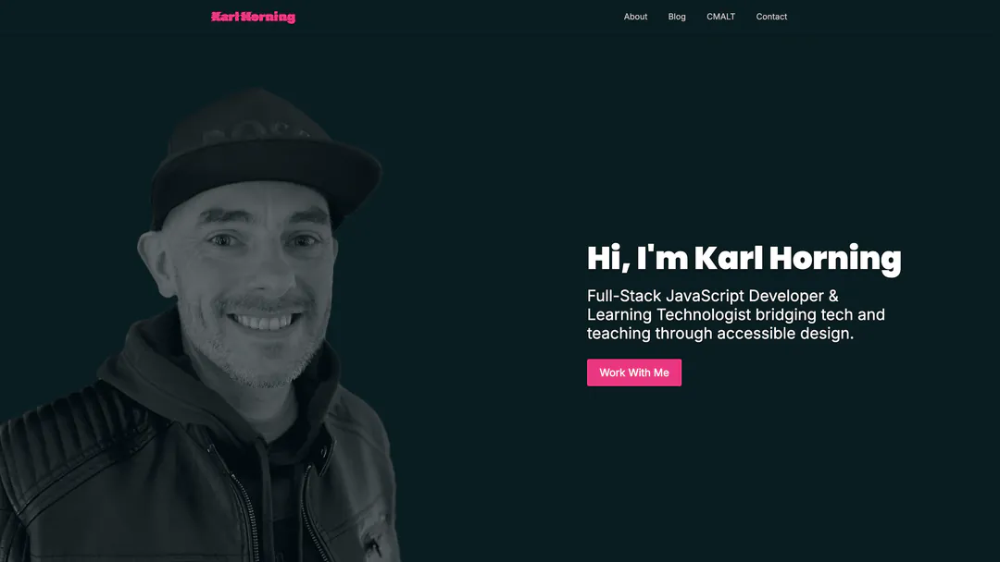

# Karl Horning's Portfolio Site

---

<p>
  
  <!-- Overall (Mobile) -->
  
  <!-- Category badges with contrasting colours -->
  
  
  
  
  <!-- Extras -->
  
  
</p>

---

## 📖 Table of Contents

- [Karl Horning's Portfolio Site](#karl-hornings-portfolio-site)
  - [📖 Table of Contents](#-table-of-contents)
  - [🤓 Overview](#-overview)
  - [📸 Screenshot](#-screenshot)
  - [🛠️ Tech Stack](#️-tech-stack)
  - [📦 Installation](#-installation)
  - [🚀 Scripts](#-scripts)
  - [📁 Project Structure](#-project-structure)
  - [✍️ Code Style \& Linting](#️-code-style--linting)
  - [🔍 Tests](#-tests)
  - [🌐 Live Site](#-live-site)
  - [📌 Roadmap](#-roadmap)
  - [🧪 Known Issues](#-known-issues)
  - [📄 Licence](#-licence)
  - [👤 Author](#-author)

---

## 🤓 Overview

This is the source code for my personal portfolio site, built with [Next.js](https://nextjs.org/), [TypeScript](https://www.typescriptlang.org/), and [Tailwind CSS](https://tailwindcss.com/).  

It showcases my work, values, skills, and certifications, with a focus on performance, accessibility, and clean design.  

The site achieves **90+ scores across Performance, Accessibility, Best Practices, and SEO in Lighthouse audits**.

---

## 📸 Screenshot



---

## 🛠️ Tech Stack

- **Framework**: [Next.js 14](https://nextjs.org/)
- **Languages**: TypeScript, JavaScript (ES6+)
- **Styling**: Tailwind CSS, AOS (Animate on Scroll)
- **Icons**: React Icons, FontAwesome
- **Image Optimisation**: Sharp
- **Linting & Formatting**:
  - ESLint (with `eslint-config-next`)
  - Prettier (with Tailwind plugin)

---

## 📦 Installation

```bash
git clone https://github.com/Karl-Horning/Karl-Horning.github.io.git
cd Karl-Horning.github.io
npm install
```

---

## 🚀 Scripts

| Command         | Description             |
| --------------- | ----------------------- |
| `npm run dev`   | Start local development |
| `npm run build` | Build for production    |
| `npm start`     | Start production server |
| `npm run lint`  | Run ESLint checks       |

---

## 📁 Project Structure

```bash
src/
├── app/
│   ├── about/             # About page route
│   ├── contact/           # Contact page route
│   ├── layout.tsx         # Root layout for App Router
│   ├── not-found.tsx      # Custom 404 page
│   └── page.tsx           # Home page route
├── components/            # Reusable UI components
├── constants/             # Static values & config
├── lib/                   # Utility functions & helpers
├── types/                 # Custom TypeScript types
```

---

## ✍️ Code Style & Linting

This project follows:

- ESLint with `eslint-config-next`
- Prettier with the Tailwind plugin
- Conventional Commits (including custom scopes such as `a11y` and `ux`)

---

## 🔍 Tests

Testing will be added using **Jest** and **React Testing Library**.

```bash
npm run test
```

---

## 🌐 Live Site

Visit the live site: [karlhorning.dev](https://www.karlhorning.dev)

---

## 📌 Roadmap

- [x] Add print styles
- [x] Remove h1 background image when styles are disabled
- [x] Correct `HomeRout`
- [x] Add correct routes to CMALT page metadata
- [x] Improve Lighthouse scores
- [ ] Add tests
- [ ] Add analytics

---

## 🧪 Known Issues

None currently.

---

## 📄 Licence

MIT © 2025 Karl Horning

---

## 👤 Author

Made with ❤️ by [Karl Horning](https://github.com/Karl-Horning)
