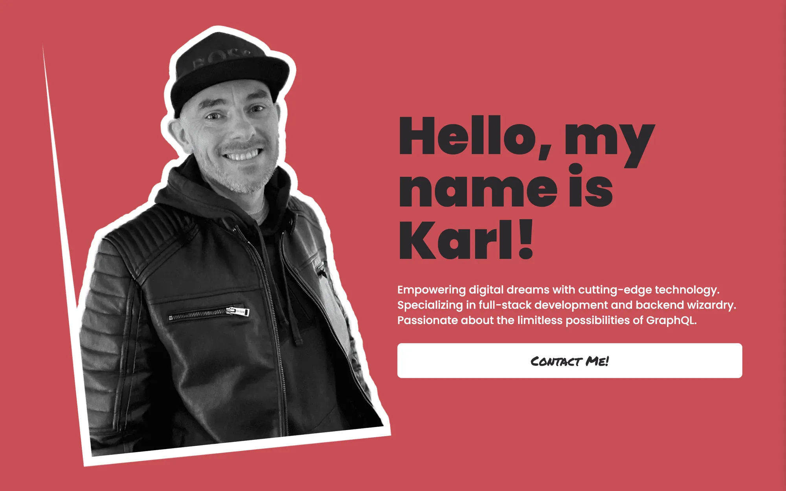

# Karl Horning's Portfolio Site

- [Karl Horning's Portfolio Site](#karl-hornings-portfolio-site)
  - [Description](#description)
  - [Demo](#demo)
  - [Getting Started](#getting-started)
  - [Feedback and Contributions](#feedback-and-contributions)
  - [Author](#author)
  - [License](#license)

## Description

This repository holds the source code for my 2024 portfolio website, designed to showcase my skills, projects, and experiences as a web developer. The portfolio is structured with a modern and responsive design, featuring media queries to ensure optimal viewing across various devices.

## Demo



[View the live demo on GitHub](https://karl-horning.github.io/).

## Getting Started

To explore the portfolio site locally, follow these steps:

1. Clone the repository:

```bash
git clone https://github.com/Karl-Horning/Karl-Horning.github.io
```

2. Install dependencies:

```bash
cd Karl-Horning.github.io
npm install
```

3. Run the development server:

```bash
npm run dev
```

4. Open your browser and navigate to `http://localhost:3000` to view the site.

## Feedback and Contributions

Feedback, suggestions, and contributions are highly appreciated! If you encounter any issues or have ideas for improvements, feel free to [open an issue](https://github.com/Karl-Horning/Karl-Horning.github.io/issues) or submit a pull request.

## Author

Karl Horning

- [GitHub](https://github.com/Karl-Horning/)
- [LinkedIn](https://www.linkedin.com/in/karl-horning/)
- [CodePen](https://codepen.io/karlhorning)

## License

This repository is licensed under the [MIT License](LICENSE).
